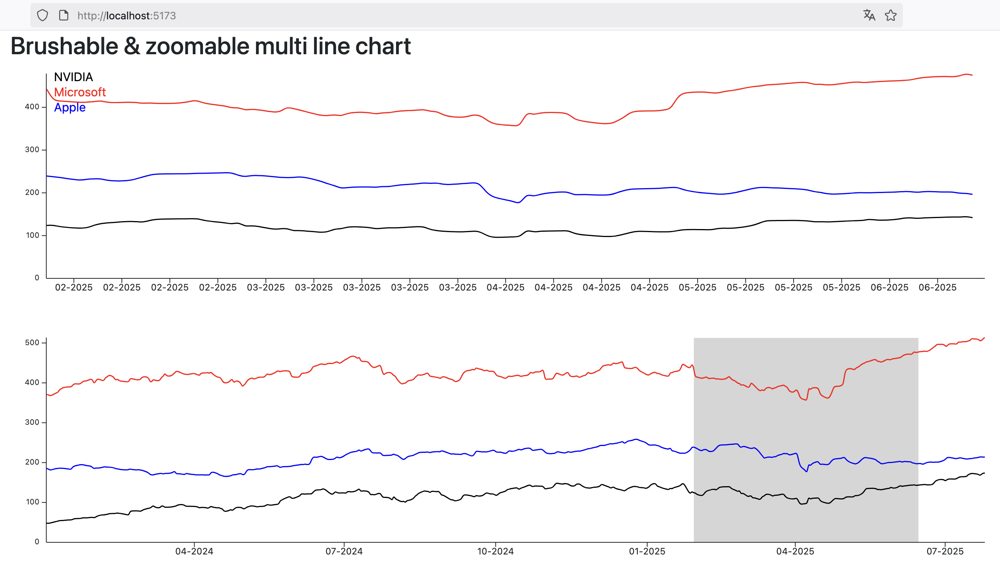

# A brushabe and zoomable chart in SvelteKit using D3js

A brushable and zoomable multi line chart in SvelteKit & D3js

## Screenshot



## Based on

- some inspiration from the following stack overflow discussion: https://stackoverflow.com/questions/57956581/svelte-and-d3-brush
- The ```Axis``` components are taken from: https://datavisualizationwithsvelte.com/basics/svelte-5-d3-example

## Installation

### Backend

You need a server that provides some data. there are 2 servers available:

- NodeJS using [koa](./backend-node)
- Rust using [axum](./backend-rust)

Or you implement your own server.

Requirements:
- a single REST endpoint ```/GET``` path ```/api/chartdata```
- returns the data provided in the file ```multline_chart.json```
- port ```3000```

#### Start either the NodeJS backend

- `npm i`
- `npm run dev`

#### Or run the Rust backend

- `cargo run`

### Start the frontend

The frontend is implemented in SvelteKit 5, d3js and bootstrap. It works :-).

- `npm i`
- `npm run dev`
